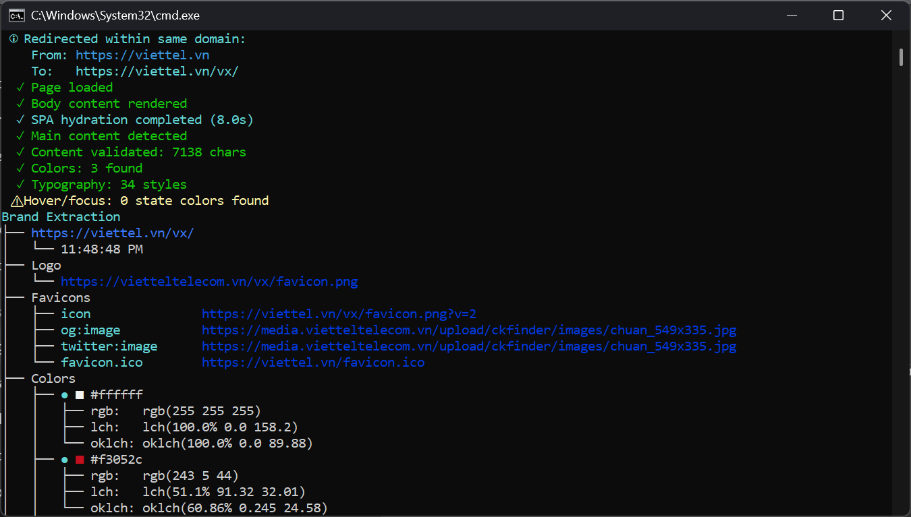

# IRIS: Intelligent Resource & Interface Scanner.

Extract any website's entire Design System—logos, colors, fonts, and spacing—into actionable design tokens in a few seconds. One command to scrape them all.



---

## Install

**Requirements:** Python 3.11+ and a sense of wonder.

Run globally:

```python
pip install -r requirements.txt

playwright install chromium firefox

python pyiris.py viettel.vn
```

## Usage

| Command Flag | What it does |
| :--- | :--- |
| `<url>` | Basic extraction (terminal display only) |
| `--save-output` | Save JSON to output/{url}/YYYY-MM-DDTHH-MM-SS.json |
| `--dtcg` | Export in [W3C Design Token](https://www.designtokens.org/) format (auto saves as .tokens.json). |
| `--dark-mode` | Force dark mode extraction. |
| `--mobile` | Use mobile viewport (390x844, iPhone 12/13/14/15) for responsive analysis|
| `--slow` | 3x timeouts (24s hydration). Use this for slow sites. |
| `--browser=firefox` | Use Firefox instead of Chromium (better for Cloudflare bypass) |
| `--json-only` | Output raw JSON to terminal (no formatted display, no file save) |


NOTE: Default formatted terminal was display only. Use `--save-output` to persist results as JSON files. Browser automatically retries in visible mode if headless extraction fails.

### Browser Selection

By default, *IRIS* uses Chromium. If you encounter bot detection or timeouts (especially on sites behind Cloudflare), try Firefox which is often more successful at bypassing these protections:

```bash
# Use Firefox instead of Chromium
python pyiris.py viettel.vn --browser=firefox

# Combine with other flags
python pyiris.py viettel.vn --browser=firefox --save-output --dtcg
```

*When to use Firefox:*
- Sites with aggressive Cloudflare bot detection
- Sites that block Chromium-based browsers
- Sites with complex anti-bot mechanisms
- When you need maximum bypass success rate

### W3C Design Tokens (DTCG) Format

Use `--dtcg` to export in the standardized [W3C Design Tokens Community Group](https://www.designtokens.org/) format:

```bash
python pyiris.py stripe.com --dtcg
# Saves to: output/stripe.com/TIMESTAMP.tokens.json
```

The DTCG format is an industry-standard JSON schema that can be consumed by design tools and token transformation libraries like [Style Dictionary](https://styledictionary.com).

### Features

Extractions are performed via CLI (`python pyiris.py <url> --save-output`) and automatically appear in the UI.

## Use Cases

- Brand audits & competitive analysis
- Design system documentation
- Reverse engineering brands
- Multi-site brand consolidation

## How It Works

Uses Playwright to render the page, extracts computed styles from the DOM, analyzes color usage and confidence, groups similar typography, detects spacing patterns, and returns actionable design tokens.

### Extraction Process

1. Browser Launch - Launches browser (Chromium by default, Firefox optional) with stealth configuration
2. Anti-Detection - Injects scripts to bypass bot detection
3. Navigation - Navigates to target URL with retry logic
4. Hydration - Waits for SPAs to fully load (8s initial + 4s stabilization)
5. Content Validation - Verifies page content is substantial (>500 chars)
6. Parallel Extraction - Runs all extractors concurrently for speed
7. Analysis - Analyzes computed styles, DOM structure, and CSS variables
8. Scoring - Assigns confidence scores based on context and usage

### Color Confidence

- High — Logo, brand elements, primary buttons
- Medium — Interactive elements, icons, navigation
- Low — Generic UI components (filtered from display)
- Only shows high and medium confidence colors in terminal. Full palette in JSON.

## Limitations

- Dark mode requires --dark-mode flag (not automatically detected)
- Hover/focus states extracted from CSS (not fully interactive)
- Canvas/WebGL-rendered sites cannot be analyzed (e.g., Tesla, Apple Vision Pro demos)
- JavaScript-heavy sites require hydration time (8s initial + 4s stabilization)
- Some dynamically-loaded content may be missed
- Default viewport is 1920x1080 (use --mobile for 390x844 iPhone viewport)

## Ethics & Legality

TL;DR: Analyzing public CSS is generally legal (US DMCA § 1201, EU Software Directive).
Don't be a jerk: Use this for inspiration and audits, not for building a 1:1 clone of a competitor’s site. Respect robots.txt and don't mass-crawl.

## Contributing

Found a bug or a website that breaks the scanner? Pull requests are welcome—even small ones!

Please submit an issue or PR to [Issues](https://github.com/mangodxd/iris/issues).

Let's keep improving IRIS together!

---

License: MIT — No restrictions.